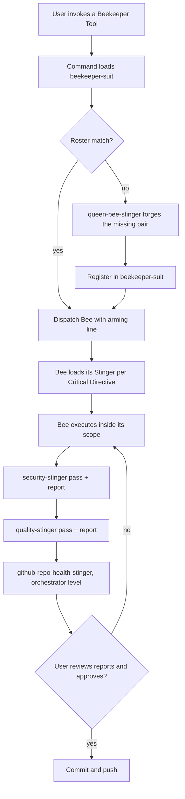

# The Hive architecture

The Hive is a self-contained, closed-loop, methodically procedural agentic software development system. It runs on four harnesses (Claude Code, Cursor, ChatGPT Codex, Claude Cowork) and turns a repository into a coordinated colony: an orchestrator that routes, focused workers that execute, mandatory knowledge that arms them, and a gate that nothing ships around.

## The component taxonomy

| Hive name | Generic | Role in the loop |
|---|---|---|
| Rules | Rules | Standing law. Always-loaded or path-scoped guidance the whole colony obeys |
| Beekeeper Tools | Commands | Entry points. User-invoked workflows with clearly defined mandatory processes |
| Bees | Agents | Workers. Focused subagents, each owning one domain |
| Stingers | Skills | Knowledge. Single-domain procedural arsenals in the Agent Skills format |
| Plugins | Plugins | Distribution. The installable bundle that carries the other four across machines and harnesses |

## The pairing law

Every Bee is paired with exactly one Stinger, and every Stinger with exactly one Bee. The Bee is persona plus guardrails; the Stinger is the knowledge it wields. A Bee dispatched without its Stinger loaded is a failed dispatch: terminate and re-dispatch.

The pairing is enforced by two verbatim text blocks that queen-bee-stinger bakes into every component it forges:

- The **agent Critical Directive** at the top of every Bee body: load your core skill now, before any planning or execution, read all of it, supplement from the internet and knowledge base if it falls short, and here are the related skills.
- The **skill Critical Directive** at the end of every Stinger: read all files in this skill, supplement if insufficient, related skills listed.

Three skills are exempt from the pairing law because they operate at the harness orchestrator level, wielded by the main agent rather than a subagent:

| Skill | Function |
|---|---|
| `beekeeper-suit` | Routing. The roster of every registered Bee, its domain, triggers, and guide. The orchestrator consults it to decide who owns a task |
| `queen-bee-stinger` | Creation. The forge that builds and validates new rules, plugins, commands, Bees, and Stingers |
| `get-started-stinger` | Repository initialization. It establishes and hardens a healthy project baseline before domain work begins |

No other skill may go unpaired. If you find one, it is either a candidate for a new Bee or a candidate for deletion.

## The closed loop

Every unit of Hive work follows the same circuit:

Three rules keep the loop closed:

1. **Commands route through the beekeeper.** Every Beekeeper Tool loads `beekeeper-suit` first, so no work bypasses the roster. If no Bee owns the task, the orchestrator handles it inline or forges a new pair; it never improvises a Bee.
2. **Bees stay in their lanes.** Each Bee owns one domain and the files in its scope. During parallel sessions, no Bee modifies another Bee's active work. Missing inputs get batched clarifying questions, not placeholder guesses.
3. **Nothing ships around the Ship Gate.**

## The Ship Gate

Prior to committing any code to the repository, development-focused work runs, in order:

1. **security-stinger.** Thorough security pass. Report written to the repository's relevant `library/` directory for the executing agent and skill. All medium or above findings resolved, then the updated code is re-evaluated in full before proceeding.
2. **quality-stinger.** Same discipline: pass, report, resolve medium and above, re-evaluate. Never run quality before security; security fixes invalidate the QA result.
3. **github-repo-health-stinger.** An orchestrator-level task. Sub-agents must reinforce to the orchestrating agent that it loads this skill itself before committing or pushing; a subagent does not run this gate on the orchestrator's behalf.
4. **User approval.** The user reviews the reports and the agent summary and approves the commit and push before either happens. No silent shipping.

The Ship Gate text is a verbatim block that ends every development-focused command, Bee, and Stinger. Research-only components may omit it; anything that can touch code may not.

## Deployment across the four harnesses

Vibe Coding Tools is the canonical home of every component. Each harness consumes the same content through its own surface:

| Surface | Claude Code | Cursor | Codex | Cowork |
|---|---|---|---|---|
| Rules | `CLAUDE.md` + `.claude/rules/` | `.cursor/rules/*.mdc` + `AGENTS.md` | `AGENTS.md` hierarchy | Global and Folder instructions |
| Commands | `.claude/commands/` or skills | skills (commands legacy) | skills (prompts deprecated) | plugin `commands/` + skills |
| Bees | `.claude/agents/` | `.claude/agents/`, also reads `.claude/agents/` | `agents.<role>` in config.toml | plugin `agents/` |
| Stingers | `.claude/skills/` | `.claude/skills/`, also reads `.claude/skills/` | `.agents/skills/` | claude.ai account sync + plugins |
| Distribution | `.claude-plugin` plugins + marketplaces | Cursor plugins + Agent Plugins standard | `.codex-plugin` plugins, reads `.claude-plugin` marketplaces | same `.claude-plugin` format as Claude Code |

Authoring strategy that falls out of this: keep `.claude/skills/` and `.claude/agents/` as the single source of truth (Cursor reads them natively as fallback paths), bridge rules through `AGENTS.md` plus thin per-harness wrappers, and package for Codex and Cowork through the plugin layer. The full detail lives in [harness-support-matrix.md](harness-support-matrix.md) and [per-type-per-harness-specific-guide.md](per-type-per-harness-specific-guide.md).

## Design principles

- **Procedural over improvised.** Mandatory processes are written down in commands and templates, not remembered.
- **Grounded over confident.** Harness behavior claims trace to `references/research/`. Unresolved conflicts stay flagged as conflicts.
- **Progressive disclosure.** Lean SKILL.md roots, deep material in guides and references loaded on demand. Skills cost nothing until used; rules cost every turn. Choose accordingly.
- **Portability by default.** Spec-six skill frontmatter, no dynamic shell injection, no hardcoded absolute paths. A component that only loads in one harness is a special case, not the norm.
- **Goal oriented, gate enforced.** Work is done when acceptance criteria pass the Ship Gate, not when the diff looks plausible.
