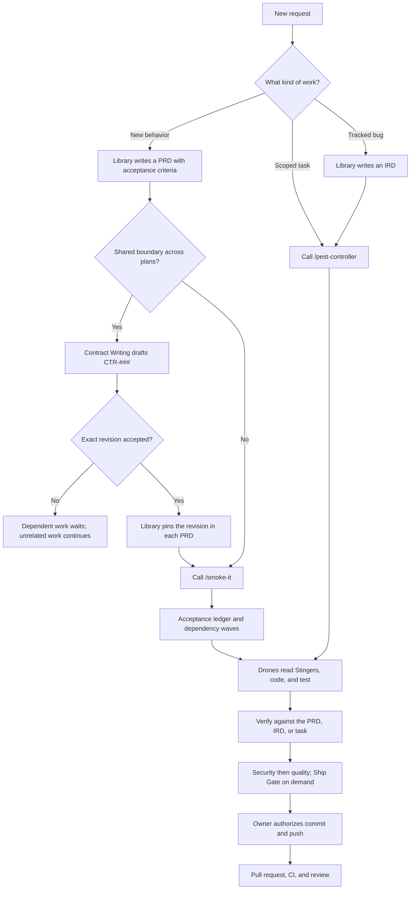
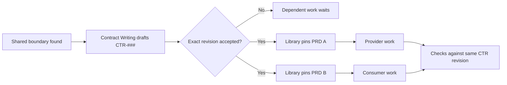

<!-- Generated from the source publication template. Edit the source template, not this public copy. -->
<div align="center">

<a href="assets/the-wasp-nest.png"></a>

# The Wasp Nest

### Get the Git life.

**139 specialist Drones, 176 Stingers, commands, hooks, and rules across 6 installable plugins.**

Give your coding assistant the people, playbooks, and project memory it needs to build.

[](https://github.com/legioncodeinc/vibe-coding-tools/releases)
[](https://github.com/legioncodeinc/vibe-coding-tools/actions/workflows/release.yml)
[](LICENSE.md)

</div>

<div align="center">

<a href="https://www.ospry.ai">
  <picture>
    <source media="(prefers-color-scheme: dark)" srcset="https://raw.githubusercontent.com/legioncodeinc/brands/main/ospry/logos/png/core-assets/transparent/horizontal-white-1024.png">
    <source media="(prefers-color-scheme: light)" srcset="https://raw.githubusercontent.com/legioncodeinc/brands/main/ospry/logos/png/core-assets/transparent/horizontal-ink-1024.png">
    
  </picture>
</a>

<sub>Want to know what will actually drive more revenue? <strong><a href="https://www.ospry.ai">OSPRY</a></strong> is the insight engine built for exactly that.</sub>

</div>

## Start here

Install [Claude Code](https://code.claude.com/docs/en/overview) or [Codex](https://developers.openai.com/codex), then add the public marketplace. In Claude Code, enter these in the assistant's command prompt:

```text
/plugin marketplace add legioncodeinc/vibe-coding-tools
/plugin install wasp-nest-core@wasp-nest
```

In a terminal with Codex installed, add the same marketplace and select the core in the plugin browser:

```bash
codex plugin marketplace add legioncodeinc/vibe-coding-tools
```

You should then see **The Wasp Nest** and its individually installable packs. Choose only the packs your work needs. Claude plugin skills use the plugin name as their namespace, such as `/wasp-nest-core:get-started-stinger`; Codex presents installed skills through its plugin surface. Harness capabilities differ, so consult [the compatibility guide](learn/reference/HARNESS-CAPABILITIES.md) for Cursor and Cowork too.

Open the repository you want to work on and ask:

```text
Use the Get Started Stinger to inspect this repository. Explain the home instruction setup and the project Library setup, ask before changing either, and show me the resulting diff and setup report.
```

On supported local sessions, the first-session hook checks `~/.legioncodeinc.lock` and then the repository's `wasp-nest.lock`. Each missing setup is an offer, not permission to change files. An existing codebase also gets a Knowledge pass before its Library setup is marked complete. [Read the public getting-started guide](learn/guides/GETTING-STARTED.md) before accepting either offer.

## The problem this fixes

Your assistant can write code, but it does not arrive knowing your product, past decisions, or definition of done. You repeat the stack, the standards, and the reason a feature exists, then hope none of that context is lost on the next task.

The Wasp Nest puts those agreements where the work happens. Drones own bounded specialties. Their Stingers carry methods, examples, and cited research. The Library keeps project knowledge, planned features, issue fixes, and shared contracts available to the next agent. The goal is fewer confident wrong turns and work you can verify against decisions already written down.

## The Library is the workbench

The Library belongs to the repository you are building, not to this marketplace. It separates facts about today's system from promises about tomorrow's system. Get Started offers to create it after consent; if code already exists, Knowledge documents that code first. Human-only `library/notes/` is not agent input.

| Record | Write it when | Who helps |
| --- | --- | --- |
| Knowledge and ADR | You need current system truth or the reason for an architecture choice. | Knowledge or ADR Writing Stinger. |
| PRD | You plan new behavior and need observable acceptance criteria. | Library Stinger. |
| IRD | A tracked bug needs a bounded fix and proof, using its issue number. | Library Stinger. |
| `CTR-###` | Two or more plans depend on the same API, event, data shape, permission, or state transition. | Contract Writing drafts; you accept the exact revision; Library pins it in each affected PRD. |

Read [why the Library exists](learn/concepts/WHY-THE-LIBRARY.md) or the practical guides to [write a PRD](learn/guides/WRITE-A-PRD.md), [write an IRD](learn/guides/WRITE-AN-IRD.md), and [agree on a CTR](learn/guides/WRITE-A-CTR.md). A Draft CTR does not make dependent PRDs ready. Independent work can continue while that decision is open.

## From request to reviewed code



`/smoke-it` is the full PRD execution path. It selects Drones from the roster itself, so you do not need to call `/pest-controller` first. Use `/pest-controller` to route a bounded task or IRD fix. Smoke It includes security and quality close-out; `/ship-gate` is the on-demand gate for a scoped diff. Neither command grants permission to commit, push, or deploy.

For parallel PRDs, one accepted contract revision is the handoff:



A Draft or disputed contract blocks the dependent boundary. [The learning path](learn/README.md) has the document-authoring guides, worked example, and more diagrams.

## What to call

| Situation | Ask for | What happens |
| --- | --- | --- |
| New or existing repository has no Library | `get-started-stinger` | Offers home and project setup separately, preserves existing work, and reports its changes. |
| Planned feature | `library-stinger`, then `/smoke-it` once the PRD is ready | Defines criteria before code, then tracks implementation and verification. |
| Shared provider and consumer behavior | `contract-writing-stinger` before dependent PRDs finish | Records a CTR, requests acceptance, and hands the revision to Library for PRD pins. |
| Tracked defect or bounded task | `library-stinger` for an IRD if tracked, then `/pest-controller` | Routes a scoped fix to an armed Drone. |
| Standalone pre-ship check | `/ship-gate` | Reviews the diff in order: security, quality, repository health, then your decision. |

Commands above are Claude Code entry points. Where a harness has no native command surface, use its corresponding Stinger or ask for the workflow by name. None of these names authorize publishing, deployment, or a push by themselves.

## The parts, in plain English

| Piece | What it is |
| --- | --- |
| **Drone** | A specialist agent with a bounded responsibility. |
| **Stinger** | The procedure and reference material a Drone reads before working. Some Stingers are standalone orchestrators. |
| **Pest Controller** | The router that chooses and arms the right Drone. |
| **Smoke It** | The execution workflow that drives PRD criteria to verified completion. |
| **Rule** | A persistent operating boundary for supported harnesses. |
| **Hook** | A lifecycle check, including the consent-based first-session setup offer. |

The Drone and Stinger pairing is enforced by the source validator. A missing pairing is not silently shipped.

## What ships

Marketplace release **v2.0.0**. The core and add-on packs have independent manifest versions; counts and descriptions below are read from the built plugins, not maintained by hand.

| Plugin | Version | Stingers | Drones | What it does |
| --- | --- | ---: | ---: | --- |
| [wasp-nest-core](plugins/wasp-nest-core/README.md) | 2.0.0 | 119 | 115 | The Wasp Nest core: shared Drones and Stingers, orchestration commands, rules, and hooks. |
| [content-intelligence](plugins/content-intelligence/README.md) | 0.1.0 | 2 | 0 | Research current GitHub repository trends and news, verify one story, and prepare evidence-backed social post drafts. |
| [highlevel](plugins/highlevel/README.md) | 0.1.0 | 3 | 3 | HighLevel integration, AI Studio creation, and offline workflow-export visualization, with a dedicated Drone and Stinger for each domain. |
| [littlebird-toolkit](plugins/littlebird-toolkit/README.md) | 2.0.0 | 30 | 0 | Thirty skills that turn your Littlebird memory into work you can act on. |
| [webapp-capture](plugins/webapp-capture/README.md) | 1.1.0 | 1 | 1 | Capture any live web app the way users see it: demo videos with screenshots, captions, and scripts; a full UI component library with measured styles and DTCG design tokens; a Claude Design handoff zip; a shadcn/ui migration map; and visual and code inconsistency audits. |
| [website-auditor](plugins/website-auditor/README.md) | 0.1.0 | 21 | 20 | Repeatable, harness-portable website audit tool: AEO/SEO, security, UX/funnel, accessibility, and analytics assessment for any site, with a branded XLSX scorecard and customer/auditor reports. |

The [Claude catalog](.claude-plugin/marketplace.json) and [Codex catalog](.agents/plugins/marketplace.json) expose these packs individually. Runtime guides and research distillations ship with them. Raw research archives, `node_modules/`, and ingested photography models do not. The photography pack retains only its blank model template.

The [complete plugin catalog](learn/reference/PLUGIN-CATALOG.md) lists every shipped Drone and Stinger by pack, with direct links to its instructions.

## Learn and build on it

- [Getting Started](learn/guides/GETTING-STARTED.md): install, consent, and first project setup.
- [Components](learn/guides/COMPONENTS.md): Drones, Stingers, commands, rules, and hooks.
- [Write a PRD](learn/guides/WRITE-A-PRD.md), [IRD](learn/guides/WRITE-AN-IRD.md), or [CTR](learn/guides/WRITE-A-CTR.md), then [execute the plan](learn/guides/PRD-EXECUTION.md) with evidence.
- [Model Selection](learn/guides/MODEL-SELECTION.md), [Security and Secrets](learn/guides/SECURITY-AND-SECRETS.md), and [Troubleshooting](learn/guides/TROUBLESHOOTING.md).

This public repository is generated from the private Wasp Nest source. Please [open an issue](https://github.com/legioncodeinc/vibe-coding-tools/issues) for a correction or a new Drone, Stinger, command, hook, or pack request rather than editing generated files directly. Maintainers use the Queen Wasp forge and source CI to add and validate components before the next release.

## License and attribution

The Wasp Nest is created by **Mario Aldayuz and [Legion Code Inc.](https://www.legioncodeinc.com)**. First-party material is licensed under [AGPL-3.0-or-later](LICENSE.md). Embedded third-party material retains its own rights; see [third-party notices](THIRD-PARTY-NOTICES.md) and each pack's notices. This license replaces prior repository-specific usage terms.

Built for vibe coders. Go ship something you can prove works.

---

<div align="center">

<picture>
  <source media="(prefers-color-scheme: dark)" srcset="https://raw.githubusercontent.com/legioncodeinc/brands/main/legion-code-inc/logos/legion-symbol-dark.svg">
  <source media="(prefers-color-scheme: light)" srcset="https://raw.githubusercontent.com/legioncodeinc/brands/main/legion-code-inc/logos/legion-symbol-light.svg">
  
</picture>

<sub><strong>We are Legion. Vibe with Legion.</strong></sub>

</div>
