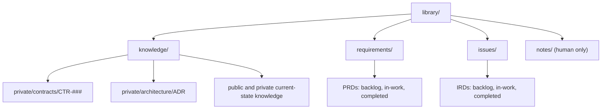
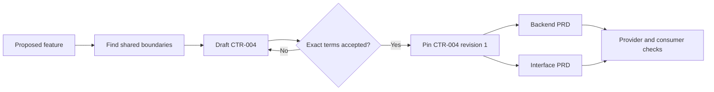
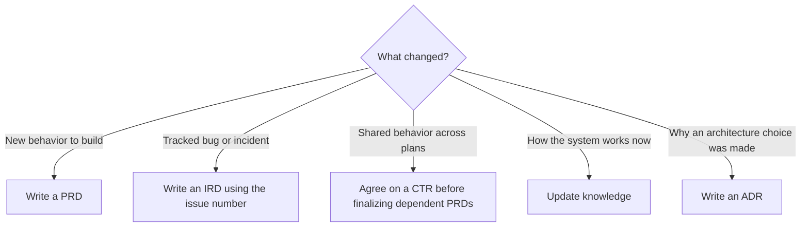

# Why the Library exists

The Library gives a repository one place for plans, current knowledge, and the agreements that connect independently built features. A code change can answer what the system does today. The Library also answers what the team agreed to build, why, and what evidence will show that it works.

This is the Wasp Nest's documentation convention, not a requirement imposed by Claude, Codex, or GitHub. [Get Started](../../plugins/wasp-nest-core/skills/get-started-stinger/SKILL.md) offers to create the folders in a repository after the user consents. [Library Stinger](../../plugins/wasp-nest-core/skills/library-stinger/SKILL.md) maintains their structure and lifecycle. The [Contract Writing Stinger](../../plugins/wasp-nest-core/skills/contract-writing-stinger/SKILL.md) owns shared contract records.

## Four things, four jobs

| Item | Question it answers | When to use it | Where it lives |
| --- | --- | --- | --- |
| Library | Where is the source of truth for this work? | Once per repository, as the home for the documents below | `library/` |
| PRD, Product Requirements Document | What new product behavior will we build, and how will we know it is done? | A planned feature or product change | `library/requirements/backlog/prd-<###>-<slug>/` |
| IRD, Issue Requirements Document | What is broken, what is the fix boundary, and how will we verify it? | A tracked bug or incident after a GitHub issue exists | `library/issues/backlog/ird-<issue-number>-<slug>/` |
| CTR-###, contract record | What exact shared behavior do two or more pieces rely on? | Before parallel PRDs depend on the same API, event, data shape, permission rule, or state transition | `library/knowledge/private/contracts/CTR-<###>-<slug>.md` |

The Library also holds current-state knowledge in `knowledge/public/` and `knowledge/private/`, architecture decisions in `knowledge/private/architecture/`, and verification evidence with the PRD or IRD it checks. `library/notes/` is human-only scratch space and is not a source for AI agents.

## A PRD is a build agreement, not a task list

A PRD describes a planned outcome, the behavior in scope, constraints, and acceptance criteria that can be checked against evidence. Its number is the next unused three-digit number within that repository, not a GitHub issue number. A larger feature can keep an index and several sub-PRDs in one folder, so separate owners can work on the backend, interface, and other surfaces without losing the common goal.

For example, `prd-007-user-export/` may hold `prd-007-user-export-index.md`, `prd-007a-user-export-backend.md`, and `prd-007b-user-export-interface.md`. That describes new export capability. A checklist item such as "build an endpoint" alone would not tell a reviewer which response states, access rules, or failure behavior are acceptable.

## An IRD turns a reported problem into a bounded fix

An IRD starts from an existing GitHub issue. It records the observed problem, affected behavior, fix scope, and verification that would demonstrate the issue is resolved. Its number matches the GitHub issue number, which makes the report and fix plan traceable to each other. An IRD stays focused on one issue and has no sub-IRDs.

For example, `ird-042-stale-cache/` is appropriate for a cache bug tracked as issue 42. It is not the place to plan an unrelated export feature. If the fix reveals a new product capability, that capability gets its own PRD.

Both PRD and IRD folders move as a whole from `backlog/` to `in-work/` to `completed/`. The folder's location is its lifecycle state. Completion requires evidence against the acceptance criteria, not merely code that exists. Evidence for a particular plan stays in its `qa/` subfolder.

## A CTR lets PRD authors work in parallel

A CTR records one stable, observable boundary shared by independently authored work. It identifies provider and consumers, exact behavior, errors and edge cases, compatibility expectations, and who will verify each side. It is not a legal contract and it is not a replacement for a PRD. It is the common agreement that prevents two PRDs from making different assumptions about the same interface.

Consider a user export feature. The backend and interface PRDs both depend on the status response. A proposed `CTR-004-export-request-status.md` could define the endpoint, allowed status values, when a download URL is present, visibility rules, and error responses. The CTR stays **Draft** until the user accepts its exact terms. Once accepted, each affected PRD pins `CTR-004 revision 1` in a `## Contract dependencies` section. The PRDs can then be completed independently against the same boundary. A disputed or still-Draft rule blocks completion of the affected PRD boundary.

When a contract changes, the contract owner checks compatibility and affected PRDs before any revision is repinned. Accepted historical PRDs keep their original contract pin. A written agreement makes parallel planning possible, but it does not replace implementation tests or provider and consumer verification.

## Choosing the next document

The canonical folder and lifecycle rules are in the [Documentation Framework](../../plugins/wasp-nest-core/skills/get-started-stinger/templates/library/knowledge/private/standards/documentation-framework.md). The [Contract Writing example](../../plugins/wasp-nest-core/skills/contract-writing-stinger/examples/prd-parallel-handoff.md) shows a full synthetic handoff. The [Library guide map](../../plugins/wasp-nest-core/skills/library-stinger/README.md) routes PRD, IRD, and maintenance work to the right playbook.
