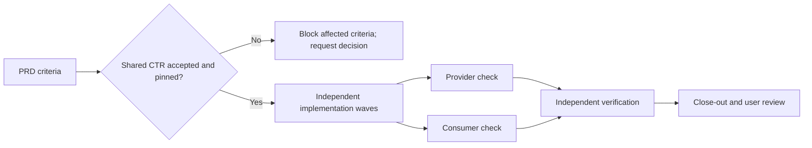

# Execute a PRD with evidence

Use a PRD when the work is planned product behavior. A PRD defines the goal, scope, constraints, and observable acceptance criteria. It is not a substitute for a shared CTR when two workstreams rely on the same interface. For the document structure, lifecycle, and a parallel-PRD example, read [Why the Library exists](../concepts/WHY-THE-LIBRARY.md) and the [Library Stinger's feature guide](../../plugins/wasp-nest-core/skills/library-stinger/guides/03-feature-prd.md).

## Establish the shared boundary first

Before separate PRD authors finalize backend and interface plans, Library identifies shared API, event, data, permission, and state boundaries. [Contract Writing](../../plugins/wasp-nest-core/skills/contract-writing-stinger/SKILL.md) records an exact agreement as `CTR-<###>` and asks for acceptance of its current revision. Library pins that revision under `## Contract dependencies` in every affected PRD. A Draft or disputed term does not become true because an implementation wave needs it.

The same check runs again at execution time. A PRD written last month may pin an obsolete revision. The [Smoke It command](../../plugins/wasp-nest-core/commands/smoke-it.md) inventories pins, records blocked boundaries, and allows independent criteria to proceed while a shared decision is pending.

## Make a ledger from the acceptance criteria

For each criterion, record its exact PRD text, an ID, an owner, dependencies, evidence location, and one state: `OPEN`, `BLOCKED`, `IN PROGRESS`, `DONE`, or `VERIFIED`. Keep `DONE` and `VERIFIED` separate. An implementer can show code and passing tests; an independent check or the close-out verifies that the result matches the PRD.

| State | Meaning |
| --- | --- |
| `OPEN` | Ready to assign but not started |
| `BLOCKED` | A specific missing decision or external dependency prevents this criterion |
| `IN PROGRESS` | Bounded work has an owner |
| `DONE` | Implementation and its own checks are complete |
| `VERIFIED` | A fresh, independent check supports completion |

Do not mark a criterion complete because a stub, mock in a production path, or a future TODO makes the happy path appear to work. The ledger must name the evidence that changed its state.

## Form execution waves

Give independent work separate file ownership and the same accepted CTR revision. Run dependent work only after its prerequisite is verified. The Pest Controller selects each Drone from its roster and arms it with the paired Stinger. For CTR-bound work, the provider and consumer checks named by the record must both run against the pinned revision before the relevant criterion is verified.

If implementation reveals that a normative term must change, stop the affected boundary. Contract Writing checks compatibility and requests acceptance of the replacement. Library repins affected PRDs before those workstreams resume. Unrelated criteria can continue.

## Close out honestly

The [Smoke It command](../../plugins/wasp-nest-core/commands/smoke-it.md) defines the full close-out and shipping workflow. A run cannot claim 100 percent completion while any criterion remains `OPEN`, `BLOCKED`, or `IN PROGRESS`. Commit, push, PR creation, and deployment are external actions and still require the authority applicable to that task. The ledger and verification output are the handoff, not a claim that the assistant "finished everything" without evidence.
