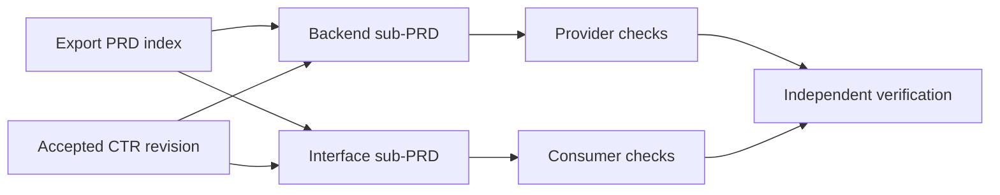

# One feature, three kinds of agreement

This synthetic ExampleApp scenario shows how the Library's documents work together. It is learning material, not an active PRD, IRD, or CTR in your repository. Copy the structure from the canonical plugin templates only after checking the real product facts and choosing unused numbers in your own Library.

## Planned feature: export status

A member requests an export and needs to know whether it is queued, processing, ready, or failed. A [PRD](../guides/WRITE-A-PRD.md) names the problem, the user, non-goals, and observable acceptance criteria. An index can split backend and interface ownership into sub-PRDs without splitting the product goal.

## Shared behavior: one status response

The backend and interface cannot be authored independently until they agree on the response values, URL visibility, and unauthorized behavior. A [CTR](../guides/WRITE-A-CTR.md) records that boundary. The user accepts a specific revision, then Library pins it in both PRDs. The [Contract Writing worked handoff](../../skills/contract-writing-stinger/examples/prd-parallel-handoff.md) shows the provider, consumer, and acceptance sequence in detail.

The PRD is not complete simply because each side has code. The provider and consumer checks must both match the same accepted revision. [PRD execution](../guides/PRD-EXECUTION.md) shows the acceptance ledger that records the evidence.

## Tracked defect: stale status

Later, a member sees processing after the export is ready. That is a reported defect, not another copy of the feature PRD. An [IRD](../guides/WRITE-AN-IRD.md) carries the GitHub issue number, observed and expected behavior, fix boundary, reproduction, and regression checks. The completed feature PRD and accepted CTR remain historical evidence; the IRD links them instead of rewriting them.

## Where to find actual starting material

- [Get Started Library templates](../../skills/get-started-stinger/templates/library/) define the folder structure.
- [Library examples](../../skills/library-stinger/examples/) illustrate plan and issue formats.
- [Contract template](../../skills/contract-writing-stinger/templates/contract-template.md) and [parallel handoff](../../skills/contract-writing-stinger/examples/prd-parallel-handoff.md) carry the normative record shape.

Do not maintain a second copy of those templates in `learn/examples/`. This page explains how they connect, while the plugin remains their source of truth.
