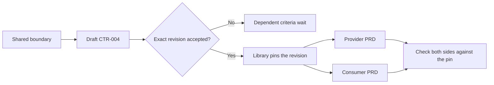

# Agree on a CTR before parallel work shares behavior

A `CTR-###` is a stable contract record for one observable boundary shared by independently authored work. It prevents a backend PRD and an interface PRD from silently making different assumptions about an API, event, data shape, permission, or state transition. It is not a legal contract and not a substitute for either PRD. [Contract Writing](../../skills/contract-writing-stinger/SKILL.md) owns its normative terms; [Library](../../skills/library-stinger/SKILL.md) pins accepted revisions in dependent PRDs.

## Before you begin

Identify the provider, every consumer, the affected PRDs, and the exact behavior they must share. If a boundary is not shared, it may belong in one PRD instead. Read the existing `library/knowledge/private/contracts/` records before allocating the next unused `CTR-###` number. A record is Draft until the user accepts its exact revision.

## 1. State one boundary precisely

Name the request or event, successful result, error result, authorization rule, state changes, timing or ordering where relevant, and compatibility expectations. Describe fields with types and allowed values when a consumer must implement against them. Leave a field open only by marking it as a question with an owner, not by letting each PRD choose independently.

For a synthetic export feature, the boundary might be `GET /exports/{id}/status`. Both provider and interface need to agree on `queued`, `processing`, `ready`, and `failed`; when a download URL exists; and what an unauthorized requester sees. A vague line such as "return export status" is not enough to support parallel implementation.

## 2. Record checks on both sides

A useful CTR identifies how the provider proves it emits each allowed state and how consumers prove they handle each state. It also names negative checks: missing export, failed export, stale revision, and unauthorized access. Do not count only a happy-path mock as contract verification.

| Record field | ExampleApp question |
| --- | --- |
| Provider | Which service returns the status? |
| Consumers | Which UI, job, or API client reads it? |
| Normative behavior | Which exact values, fields, errors, and access rules are agreed? |
| Compatibility | What happens to a consumer pinned to an older revision? |
| Provider check | Which test proves the service response? |
| Consumer check | Which test proves the client behavior? |

The [worked parallel-PRD handoff](../../skills/contract-writing-stinger/examples/prd-parallel-handoff.md) shows a full synthetic record and pins. The canonical [contract template](../../skills/contract-writing-stinger/templates/contract-template.md) is the starting structure when authoring a real one.

## 3. Ask for acceptance of an exact revision

Present the terms, open questions, affected PRDs, and revision number to the user. Showing a draft or execution plan is not acceptance. If a term is disputed, keep the record Draft and name the dependent criteria it blocks. Unrelated work may proceed. Once the user accepts revision 1, preserve that accepted content and have Library write `CTR-004 revision 1` under `## Contract dependencies` in every affected PRD.

## 4. Change a contract without rewriting history

If implementation uncovers a new normative behavior, stop the affected boundary and ask Contract Writing for an impact review. A compatible extension and a breaking change need different responses. The user accepts the replacement revision before Library repins active PRDs. Historical completed PRDs keep the revision they actually implemented; changing their pins retroactively would make their evidence misleading.

The Stinger's read-only contract validator checks paths and pins after Library changes them. It cannot accept terms for the user or prove that provider and consumer runtime behavior matches the record. Those checks belong in the affected workstreams and their verification evidence.
