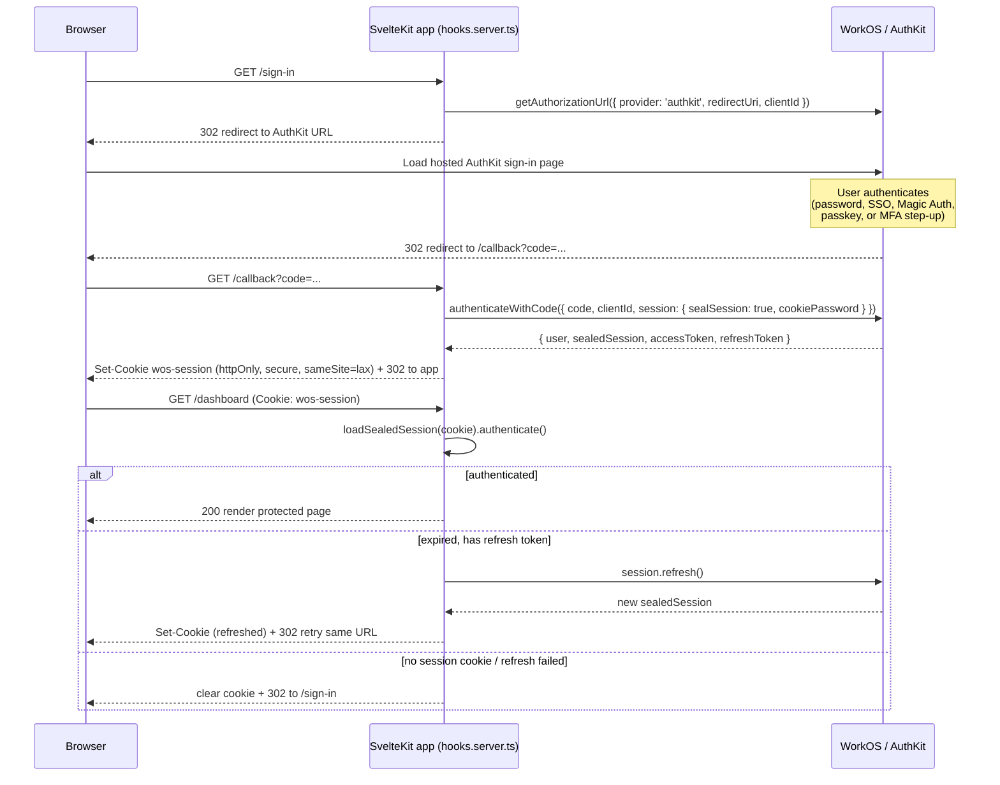
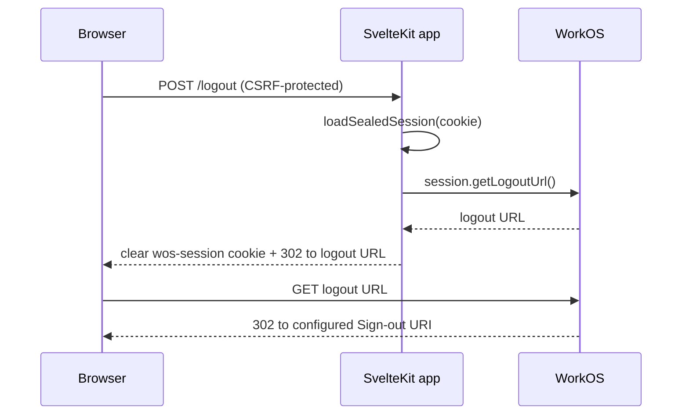

# AuthKit flow diagram

Grounded in [raw/workos--authkit--hosted-ui-overview.md], [raw/workos--authkit--nodejs-quickstart-sessions.md], and [raw/workos--authkit--sessions-reference.md]. See `research/distilled-workos.md` section 2 for the numbered narrative this diagram illustrates.

## Sign-in, callback, and protected-route flow

## Logout flow

## Notes

- The authorization code from WorkOS is valid for 10 minutes only [raw/workos--authkit--nodejs-quickstart-sessions.md].
- The sign-in endpoint (not just the callback) must be registered in the WorkOS dashboard as the Initiate login URL for IdP-initiated SSO and dashboard impersonation to complete PKCE/CSRF `state` correctly [raw/workos--authkit--sveltekit-sdk.md].
- Logout must be POST, not GET, to avoid a browser prefetch silently ending the session [raw/workos--authkit--nodejs-quickstart-sessions.md].
